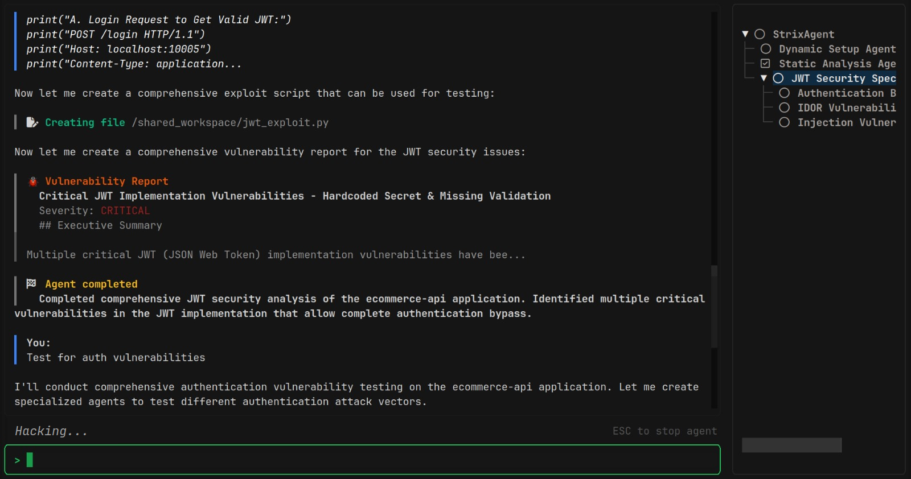

<div align="center">

# Strix

### 开源AI安全测试代理 - 为您的应用提供智能安全评估

[](LICENSE)
[](https://vercel.com/ai-accelerator)
[](https://github.com/usestrix/strix)

</div>

<div align="center">

</div>

---

## 🦉 Strix 概述

Strix是自主的AI安全代理，能够像真正的安全专家一样工作 - 它们动态运行您的代码，发现漏洞，并通过实际利用来验证这些漏洞。专为开发者和安全团队打造，提供快速、准确的安全测试，无需手工渗透测试的开销，也避免了静态分析工具的误报问题。

### 🚀 快速开始

```bash
# 安装
pipx install strix-agent

# 配置AI提供商
export STRIX_LLM="openai/gpt-5"
export LLM_API_KEY="your-api-key"

# 运行安全评估
strix --target ./app-directory

# 备选方案：使用DeepSeek
export STRIX_LLM="deepseek-chat"
export DEEPSEEK_API_KEY="your-deepseek-key"

# 备选方案：使用GLM
export STRIX_LLM="glm-4-flash"
export GLM_API_KEY="your-glm-key"

# 备选方案：使用自定义OpenAI兼容API
export STRIX_LLM="gpt-4"
export STRIX_API_BASE="https://your-api.com/v1"
export STRIX_API_KEY="your-custom-key"
```

## 为什么选择Strix

- **🛡️ 完整的黑客工具库** - 内置专业黑客所需的所有工具
- **✅ 真实验证** - 动态测试和实际利用，大幅减少误报
- **👨‍💻 开发者优先** - 无缝集成到现有开发工作流中
- **🔧 自动修复与报告** - 自动化打补丁，提供详细的修复建议和安全报告

## ✨ 核心功能

### 🛠️ 代理化安全工具

- **🔌 完整HTTP代理** - 完整的请求/响应操作和分析
- **🌐 浏览器自动化** - 多标签浏览器，用于测试XSS、CSRF、认证流程
- **💻 终端环境** - 交互式shell，用于命令执行和测试
- **🐍 Python运行时** - 自定义漏洞开发和验证
- **🔍 侦察收集** - 自动化OSINT和攻击面映射
- **📁 代码分析** - 静态和动态分析能力
- **📝 知识管理** - 结构化发现和攻击文档化

### 🎯 全面漏洞检测

- **🔐 访问控制** - IDOR、权限提升、认证绕过
- **💉 注入攻击** - SQL、NoSQL、命令注入
- **🖥️ 服务端** - SSRF、XXE、反序列化漏洞
- **🌐 客户端** - XSS、原型污染、DOM漏洞
- **💼 业务逻辑** - 竞态条件、工作流操作
- **🔑 认证** - JWT漏洞、会话管理
- **🏗️ 基础设施** - 配置错误、暴露服务

### 🕸️ 代理网络图

- **🔄 分布式工作流** - 针对不同攻击和资产的专用代理
- **⚡ 可扩展测试** - 并行执行，快速全面覆盖
- **🤝 动态协调** - 代理协作和共享发现

## 🤖 支持的AI模型

Strix通过OpenAI兼容API支持多种LLM提供商：

### OpenAI模型
```bash
export STRIX_LLM="openai/gpt-5"
export LLM_API_KEY="your-openai-key"
```

### DeepSeek模型
```bash
export STRIX_LLM="deepseek-chat"  # 或 deepseek-coder, deepseek-v2.5, deepseek-r1
export DEEPSEEK_API_KEY="your-deepseek-key"
```

### GLM模型 (智谱AI)
```bash
export STRIX_LLM="glm-4-flash"  # 或 glm-4, glm-4-air, glm-4v, 等。
export GLM_API_KEY="your-glm-key"
```

### 自定义OpenAI兼容API
```bash
export STRIX_LLM="any-model-name"
export STRIX_API_BASE="https://your-api-endpoint.com/v1"
export STRIX_API_KEY="your-api-key"
```

### 环境变量优先级
1. 配置中的显式参数
2. `STRIX_API_KEY` / `LLM_API_KEY`
3. 模型特定密钥 (`DEEPSEEK_API_KEY`, `GLM_API_KEY`, `ZHIPU_API_KEY`)
4. `OPENAI_API_KEY` (后备选项)

详细配置选项请参见 [MODEL_CONFIG.md](MODEL_CONFIG.md)。

## 💻 使用示例

```bash
# 本地代码库分析
strix --target ./app-directory

# 仓库安全审查
strix --target https://github.com/org/repo

# Web应用评估
strix --target https://your-app.com

# 重点测试
strix --target api.your-app.com --instruction "优先进行认证和授权测试"
```

### ⚙️ 配置

```bash
# 必需配置
export STRIX_LLM="openai/gpt-5"
export LLM_API_KEY="your-api-key"

# 推荐配置
export PERPLEXITY_API_KEY="your-api-key"
```

[📚 查看支持的AI模型](https://docs.litellm.ai/docs/providers)

## 🏆 企业平台

我们的管理平台提供：

- **📈 管理仪表板** - 高级管理层的安全概览
- **🧠 定制微调模型** - 针对您业务的专用AI模型
- **⚙️ CI/CD集成** - 开发流程无缝安全检查
- **🔍 大规模扫描** - 企业级批量安全评估
- **🔌 第三方集成** - 与现有工具链集成
- **🎯 企业支持** - 专业技术支持服务

[**获取企业演示 →**](https://form.typeform.com/to/ljtvl6X0)

## 🔒 安全架构

- **🐳 容器隔离** - 所有测试都在沙箱化Docker环境中进行
- **🏠 本地处理** - 测试在本地运行，数据不发送到外部服务

> [!NOTE]
> Strix目前处于Alpha阶段。预期会有快速更新和改进。

## 🇨🇳 中文用户特别说明

### 针对腾讯众测的优化配置

本项目已针对腾讯大模型专项众测进行了专门优化：

#### 🎯 超危漏洞聚焦
```bash
# 使用优化配置运行
cd tools/strix
python3 -m strix.cli run --config strix_targets.yaml --target "Cloud Studio Container Escape"

# 或直接针对容器逃逸检测
python3 -m strix.cli run \
  --target "https://cloudstudio.net/" \
  --instruction "检查容器逃逸、权限提升、代码执行漏洞，重点关注seccomp配置、cgroup设置、工作区隔离边界" \
  --timebox 15 \
  --focus critical
```

#### 🔧 众测专用配置
- **容器逃逸检测**: seccomp绕过、cgroup逃逸、mount namespace突破
- **代码注入测试**: AI模型提示词注入、执行绕过、沙箱逃逸
- **权限控制审计**: Agent权限越权、工具调用权限、会话隔离
- **API安全验证**: 认证绕过、租户隔离、数据泄露

#### 🚨 安全合规
- **沙箱模式**: 默认只读，安全可控
- **频率限制**: 遵守众测规则，避免封禁
- **数据保护**: 使用合成数据，禁止敏感信息
- **白名单扫描**: 仅扫描授权目标，禁止内网探测

### 📚 相关文档
- [腾讯众测优化指南](../README.md#🔧-strix-ai扫描器配置与使用)
- [漏洞类型说明](../../docs/vuln-guides/)
- [任务清单](../../todo.md)

---

**开始使用Strix，让AI为您发现关键安全漏洞！** 🚀